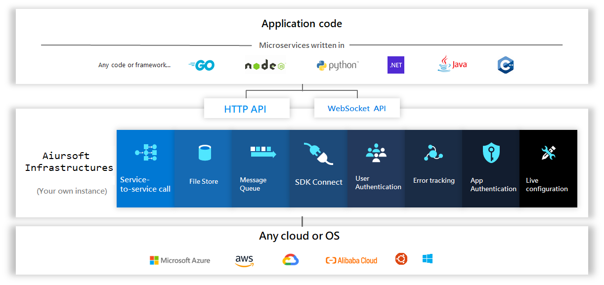

# Aiursoft Infrastructures

[](https://gitlab.aiursoft.cn/aiursoft/infrastructures/-/blob/master/LICENSE)
[](https://gitlab.aiursoft.cn/aiursoft/infrastructures/-/pipelines)
[](https://gitlab.aiursoft.cn/aiursoft/infrastructures/-/pipelines)
[](https://www.nuget.org/packages/Aiursoft.Identity/)
[](https://gitlab.aiursoft.cn/aiursoft/Infrastructures/-/commits/master?ref_type=heads)
[](https://www.aiursoft.com)

Aiursoft micro-services platform. Powered by ASP.NET Core.

## What is Aiursoft Infrastructures

Aiursoft Infrastructures provides many valuable services and simplifies web application development.

Aiursoft Infrastructures is a project, runs at the application level, using micro-services design and powers all Aiursoft applications.



Aiursoft Infrastructures provides a central platform for an entire enterprise. So the enterprise can focus on business app development.

The enterprise can deploy their dedicated instance of Aiursoft Infrastructures and build their apps with it.

## Example apps

There are some example apps based on Aiursoft Infrastructures.

* [Kahla](https://gitlab.aiursoft.cn/Aiursoft/Kahla)
* [AiurDrive](https://gitlab.aiursoft.cn/Aiursoft/AiurDrive)
* [Warp](https://gitlab.aiursoft.cn/Aiursoft/Warp)
* [Tracer](https://gitlab.aiursoft.cn/Aiursoft/Tracer)

## Features

* Integrated user authentication https://directory.aiursoft.com (OAuth, Social authenticate, password reset)
* Account management center https://account.aiursoft.com (Profile editing, Two-FA, social account, switch email)
* Developer center https://developer.aiursoft.com (App creation and permission management, basic debugging tools)
* File storage system https://probe.aiursoft.com (Compress, Clear EXIF, customize domain-name)
* Message queue https://stargate.aiursoft.com (Auto message clear, WebSocket push, channel authentication)
* Home web page https://www.aiursoft.com (Terms, privacy)
* Wiki center https://wiki.aiursoft.com (Read document)
* Cross-platform deployment (Supports Windows, Linux, and Docker)

## How to deploy

### Brief steps

* Get a domain name. (Like aiursoft.com)
* Get a new server.
* Create DNS record.
* Execute the install command on your server.

### Get a server

Get a brand new Ubuntu 18.04 server.

* Server must be Ubuntu 18.04. (20.04 and 16.04 is not supported)
* Server must have a public IP address. (No local VM)
* Server must have access to the global Internet. (Not Chinese network)

[Azure](https://www.azure.com), [Vultr](https://www.vultr.com/?ref=7274488) or [DigitalOcean](https://www.DigitalOcean.com) is suggested.

### Install on a server

Create a wildcard domain record to your server's public IP.

> Example: Resolve *.aiur.io to 123.123.123.123

Execute the following command on the server (Replace the `instance.name` to your own brand name):

```bash
curl -sL https://gitlab.aiursoft.cn/aiursoft/infrastructures/-/raw/master/install.sh | sudo bash -s aiur.io instance.name master
```

### Upgrade your server

If we released a newer version, and you can upgrade your server via:

```bash
curl -sL https://gitlab.aiursoft.cn/aiursoft/infrastructures/-/raw/master/upgrade.sh | sudo bash -s instance.name master
```

Also, you can run that upgrade script to repair some issues with your Infrastructures instance.

## The design of Infrastructures

---
title: Project dependency diagram
---
stateDiagram-v2
    Aiursoft.Canon --> Aiursoft.Scanner.Abstractions
    Aiursoft.AiurProtocol --> Aiursoft.Canon
    Aiursoft.AiurProtocol --> Aiursoft.CSTools
    Aiursoft.AiurProtocol --> Aiursoft.AiurProtocol.Abstractions
    Aiursoft.AiurProtocol.Server --> Aiursoft.AiurProtocol
    Aiursoft.CSTools --> Aiursoft.Scanner.Abstractions
    Aiursoft.WebTools --> Aiursoft.CSTools
    Aiursoft.WebTools --> Aiursoft.Scanner.Abstractions
    DemoApiApp.Sdk --> Aiursoft.AiurProtocol
    DemoApiApp --> DemoApiApp.Sdk
    DemoApiApp --> Aiursoft.WebTools
    DemoApiApp --> Aiursoft.AiurProtocol.Server

### Basic Services

The basic services are used to support the operation of the entire platform. It is the basis for the expansion of the subsequent infrastructure and user services throughout the platform. The basic services mainly include the user's authentication, authorization, application authentication, authorization, and allow the user's self-registration and self-registration of the application. At the same time, the underlying service is also responsible for the user's underlying data and the underlying data of the application, as well as the user's set of credentials and the set of credentials for the application.

### Infrastructures

Infrastructure refers to some common software tools that the platform can provide on an infrastructure-based basis. Such software tools are similar to static file storage, object storage, CDN, message queues, caching, and the like. Such services need to be registered in the underlying service and use the application authentication service and the application authorization service to check if the visitor has permission to invoke the infrastructure.

### Applications

Before discussing the user service layer, all of the underlying services and infrastructure we discussed were oriented toward other sub-services rather than user-oriented. Still, they only provided data interfaces for other service calls. Obviously, as a mature platform, developers and users should not implement the registration of services and the management of permissions by calling interfaces. Therefore, we need to develop additional programs that provide such a user-oriented terminal that allows users to operate through a concise interface and logic.

In addition to the user interface that OAuth itself needs to provide login, this layer should also provide more basic service in the microservice platform. According to the results of the needs analysis, there are account management services and developer center services in this layer. Both services rely on the infrastructure of the previous layer and provide user-oriented functionality.

Any high-level service is built on the micro-service platform. But the requirements they solve are actually based on the decisions of the companies that use the microservices platform. In other words, regardless of the company's decision-making to build search engines, forums, company homepages, feedback centers, recruitment centers, etc., the platform should be able to support. But the entire process of this part should follow the process followed by a separate software system.

## How to run locally

Running the entire micro-service platform is very complicated and requires a lot of computing resources. Before you try to run the platform, we strongly suggest running only one specific service. Running one service is very easy and simple.

To run one service instance locally, execute `dotnet run` under which folder with the project file `.csproj` you want to run.

As for each one of the sub-projects in it is a simple ASP.NET Core web project. You can reference more documents via the official ASP.NET document for how to run:

https://docs.microsoft.com/en-us/aspnet/core/getting-started/?tabs=windows#run-the-app

### Database

In debugging environment, we are using [Microsoft SQL Server LocalDb](https://docs.microsoft.com/en-us/sql/database-engine/configure-windows/sql-server-express-localdb?view=sql-server-ver15) by default. You can change the connection string in `appsettings.json` to use your own `SQL Server` instance.

In our production environment, we are using [Microsoft SQL Server](https://www.microsoft.com/en-us/sql-server).

We are using [Entity Framework Core](https://docs.microsoft.com/en-us/ef/core/) to control our database. It supports different types of databases. So our services can switch between different databases easily.

## How to contribute

The document is [here](https://wiki.aiursoft.com/Welcome/How%20to%20contribute.md).
